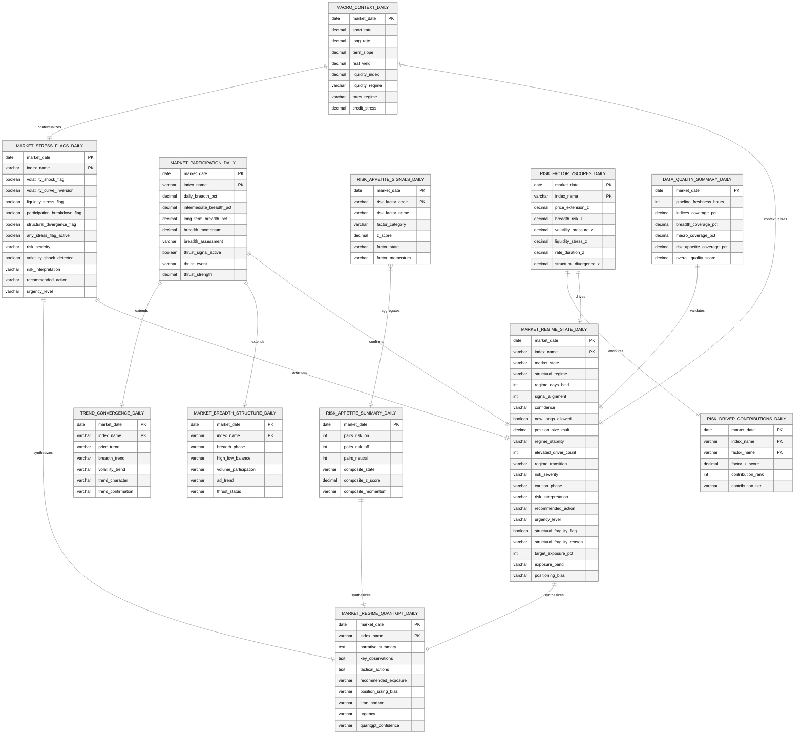

# MRI Schema Diagram

```mermaid
%%{init: {'theme': 'neutral', 'themeVariables': { 'primaryColor': '#f4f4f4', 'primaryTextColor': '#333', 'primaryBorderColor': '#666', 'lineColor': '#666', 'secondaryColor': '#fff', 'tertiaryColor': '#fff', 'background': '#ffffff'}}}%%
erDiagram
    MARKET_REGIME_STATE_DAILY {
        date market_date PK
        varchar index_name PK
        varchar market_state
        varchar structural_regime
        int regime_days_held
        int signal_alignment
        varchar confidence
        boolean new_longs_allowed
        decimal position_size_mult
        varchar regime_stability
        int elevated_driver_count
        varchar regime_transition
        varchar risk_severity
        varchar caution_phase
        varchar risk_interpretation
        varchar recommended_action
        varchar urgency_level
        boolean structural_fragility_flag
        varchar structural_fragility_reason
        int target_exposure_pct
        varchar exposure_band
        varchar positioning_bias
    }

    MARKET_STRESS_FLAGS_DAILY {
        date market_date PK
        varchar index_name PK
        boolean volatility_shock_flag
        boolean volatility_curve_inversion
        boolean liquidity_stress_flag
        boolean participation_breakdown_flag
        boolean structural_divergence_flag
        boolean any_stress_flag_active
        varchar risk_severity
        boolean volatility_shock_detected
        varchar risk_interpretation
        varchar recommended_action
        varchar urgency_level
    }

    MARKET_PARTICIPATION_DAILY {
        date market_date PK
        varchar index_name PK
        decimal daily_breadth_pct
        decimal intermediate_breadth_pct
        decimal long_term_breadth_pct
        decimal breadth_momentum
        varchar breadth_assessment
        boolean thrust_signal_active
        varchar thrust_event
        decimal thrust_strength
    }

    MARKET_BREADTH_STRUCTURE_DAILY {
        date market_date PK
        varchar index_name PK
        varchar breadth_phase
        varchar high_low_balance
        varchar volume_participation
        varchar ad_trend
        varchar thrust_status
    }

    TREND_CONVERGENCE_DAILY {
        date market_date PK
        varchar index_name PK
        varchar price_trend
        varchar breadth_trend
        varchar volatility_trend
        varchar trend_character
        varchar trend_confirmation
    }

    RISK_APPETITE_SIGNALS_DAILY {
        date market_date PK
        varchar risk_factor_code PK
        varchar risk_factor_name
        varchar factor_category
        decimal z_score
        varchar factor_state
        varchar factor_momentum
    }

    RISK_APPETITE_SUMMARY_DAILY {
        date market_date PK
        int pairs_risk_on
        int pairs_risk_off
        int pairs_neutral
        varchar composite_state
        decimal composite_z_score
        varchar composite_momentum
    }

    RISK_FACTOR_ZSCORES_DAILY {
        date market_date PK
        varchar index_name PK
        decimal price_extension_z
        decimal breadth_risk_z
        decimal volatility_pressure_z
        decimal liquidity_stress_z
        decimal rate_duration_z
        decimal structural_divergence_z
    }

    RISK_DRIVER_CONTRIBUTIONS_DAILY {
        date market_date PK
        varchar index_name PK
        varchar factor_name PK
        decimal factor_z_score
        int contribution_rank
        varchar contribution_tier
    }

    MACRO_CONTEXT_DAILY {
        date market_date PK
        decimal short_rate
        decimal long_rate
        decimal term_slope
        decimal real_yield
        decimal liquidity_index
        varchar liquidity_regime
        varchar rates_regime
        decimal credit_stress
    }

    MARKET_REGIME_QUANTGPT_DAILY {
        date market_date PK
        varchar index_name PK
        text narrative_summary
        text key_observations
        text tactical_actions
        varchar recommended_exposure
        varchar position_sizing_bias
        varchar time_horizon
        varchar urgency
        varchar quantgpt_confidence
    }

    DATA_QUALITY_SUMMARY_DAILY {
        date market_date PK
        int pipeline_freshness_hours
        decimal indices_coverage_pct
        decimal breadth_coverage_pct
        decimal macro_coverage_pct
        decimal risk_appetite_coverage_pct
        decimal overall_quality_score
    }

    MARKET_STRESS_FLAGS_DAILY ||--|| MARKET_REGIME_STATE_DAILY : overrides
    MARKET_PARTICIPATION_DAILY ||--|| MARKET_REGIME_STATE_DAILY : confirms
    RISK_FACTOR_ZSCORES_DAILY ||--|| MARKET_REGIME_STATE_DAILY : drives
    MARKET_PARTICIPATION_DAILY ||--|| MARKET_BREADTH_STRUCTURE_DAILY : extends
    MARKET_PARTICIPATION_DAILY ||--|| TREND_CONVERGENCE_DAILY : extends
    RISK_APPETITE_SIGNALS_DAILY }|--|| RISK_APPETITE_SUMMARY_DAILY : aggregates
    RISK_FACTOR_ZSCORES_DAILY ||--|| RISK_DRIVER_CONTRIBUTIONS_DAILY : attributes
    MACRO_CONTEXT_DAILY ||--|| MARKET_REGIME_STATE_DAILY : contextualizes
    MACRO_CONTEXT_DAILY ||--|| MARKET_STRESS_FLAGS_DAILY : contextualizes
    MARKET_REGIME_STATE_DAILY ||--|| MARKET_REGIME_QUANTGPT_DAILY : synthesizes
    MARKET_STRESS_FLAGS_DAILY ||--|| MARKET_REGIME_QUANTGPT_DAILY : synthesizes
    RISK_APPETITE_SUMMARY_DAILY ||--|| MARKET_REGIME_QUANTGPT_DAILY : synthesizes
    DATA_QUALITY_SUMMARY_DAILY ||--|| MARKET_REGIME_STATE_DAILY : validates
```
